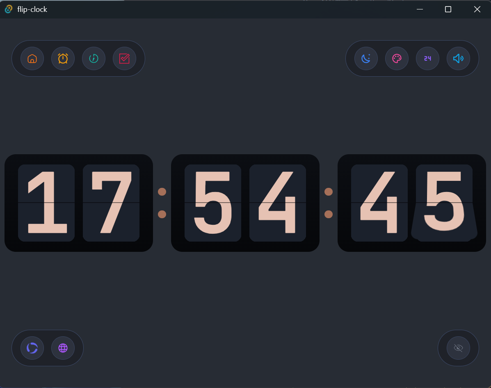
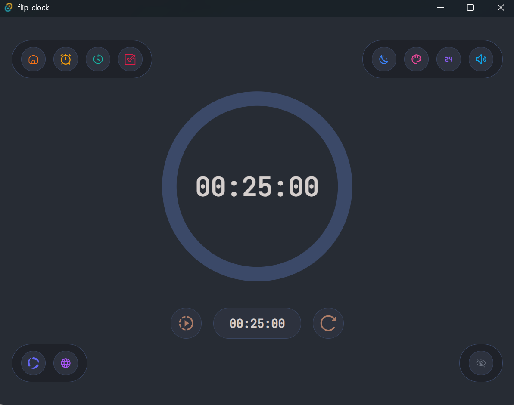
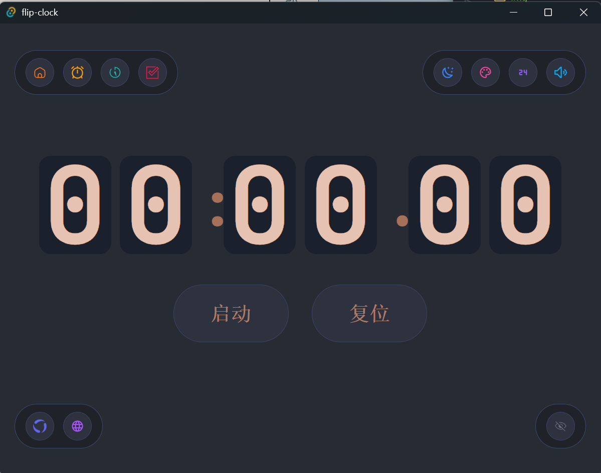
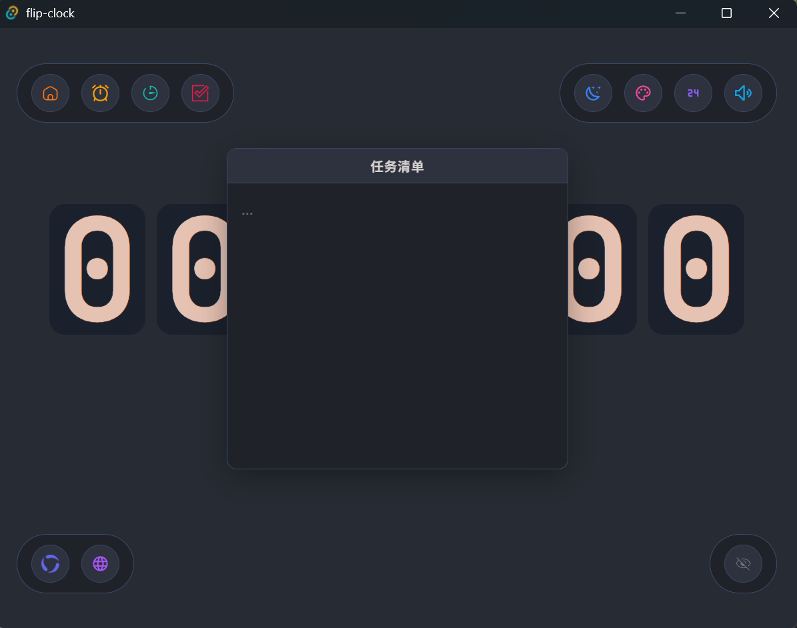
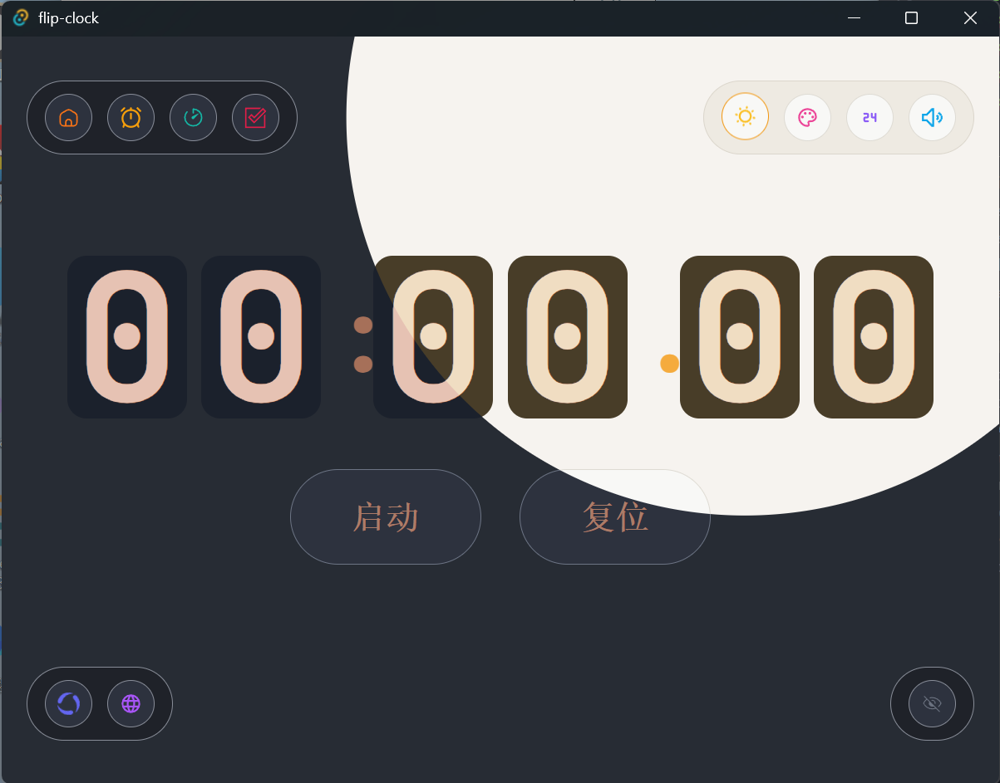
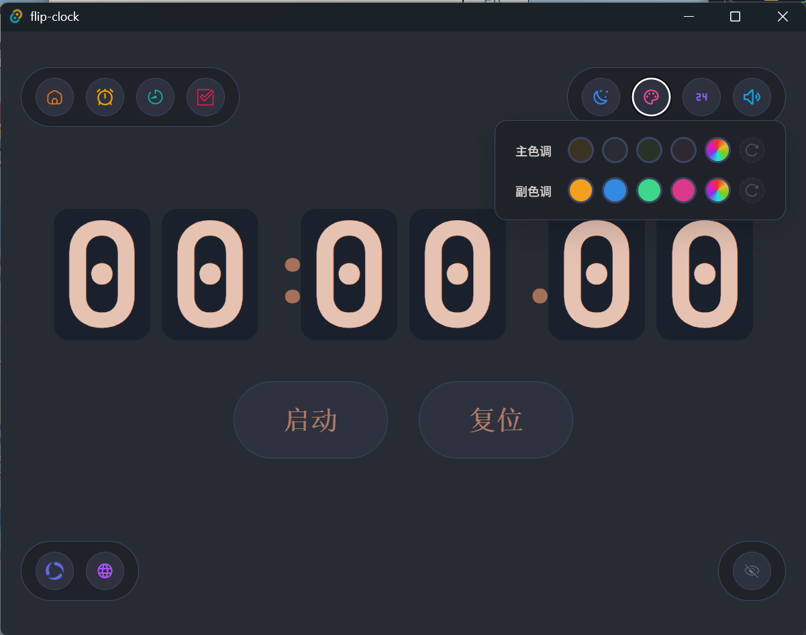
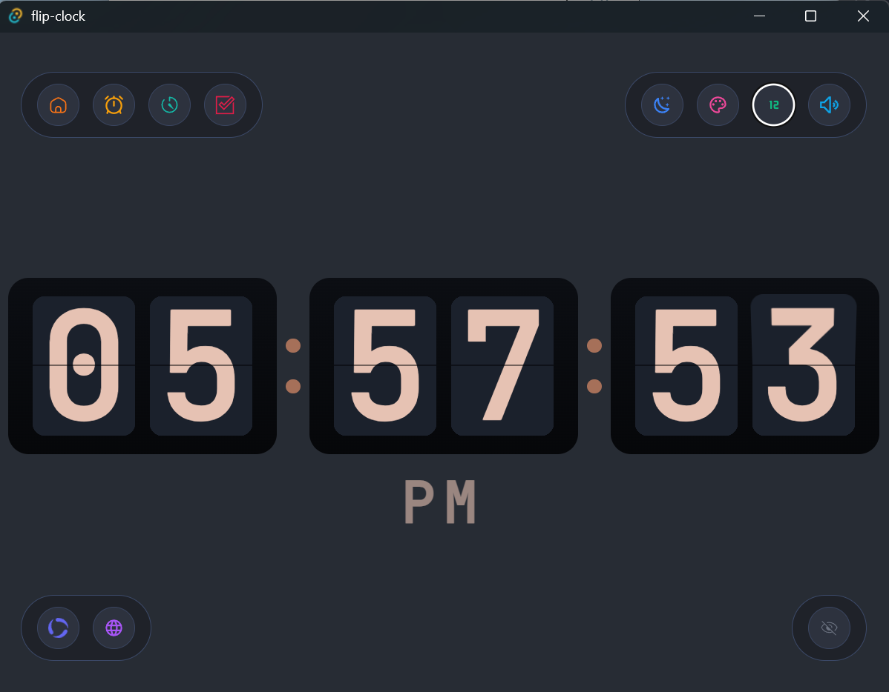
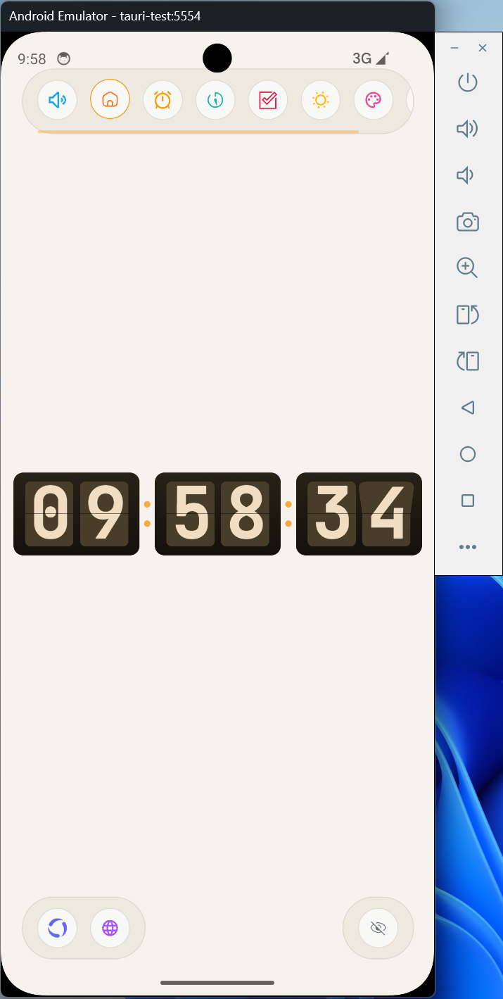

<p align="center">
  <h1 align="center">Flip Clock</h1>
  <p align="center">A versatile desktop time tool built with Vue 3 + Tauri</p>
  <p align="center">基于 Vue 3 + Tauri 的多功能桌面时钟工具</p>
</p>

---

## ✨ Features | 功能

- **Flip Clock** — Classic flip-style clock with smooth flip animation and optional tick sound
- **Focus Timer** — Pomodoro-style countdown with ring progress visualization and alarm
- **Stopwatch** — Precise stopwatch with lap/split timing
- **Task Notepad** — Draggable & resizable floating notepad
- **Customizable Dock** — Drag-and-drop icon toolbar supporting 6 dock positions
- **Theme** — Dark / Light theme switching
- **12/24h** — Time format toggle
- **i18n** — Multi-language support (English / 中文)

---

- **翻页时钟** — 经典翻页动画时钟，带翻页音效
- **专注计时** — 番茄钟倒计时，环形进度与闹铃提醒
- **秒表** — 高精度秒表，支持计圈/分段计时
- **任务便签** — 可拖拽、可缩放的悬浮记事本
- **图标坞** — 可拖拽排序的图标工具栏，支持 6 种停靠位置
- **主题切换** — 深色 / 浅色主题
- **12/24 小时制** — 时间格式切换
- **国际化** — 多语言支持（English / 中文）

## 📸 Screenshots | 截图

<div align="center">
  
  
  
  
  
  
  
  
</div>

## 🛠 Tech Stack | 技术栈

| Category  | Stack                        |
| --------- | ---------------------------- |
| Framework | Vue 3 (Composition API)      |
| Desktop   | Tauri 2                      |
| Language  | TypeScript                   |
| State     | Pinia + persisted state      |
| Routing   | Vue Router 4                 |
| i18n      | vue-i18n                     |
| Styles    | SCSS + CSS custom properties |
| Build     | Vite 8                       |

## 🚀 Getting Started | 开始

```bash
# Install dependencies
pnpm install

# Dev (browser)
pnpm dev

# Dev (Tauri desktop)
pnpm tauri dev

# Build
pnpm tauri build
```

## 📁 Project Structure | 目录结构

```
src/
├── components/    # Vue components
├── stores/        # Pinia stores
├── layouts/       # Page layouts
├── router/        # Vue Router
├── languages/     # i18n definitions
├── assets/        # Static assets (svg, mp3)
└── main.ts        # Entry
src-tauri/         # Tauri (Rust) backend
```
